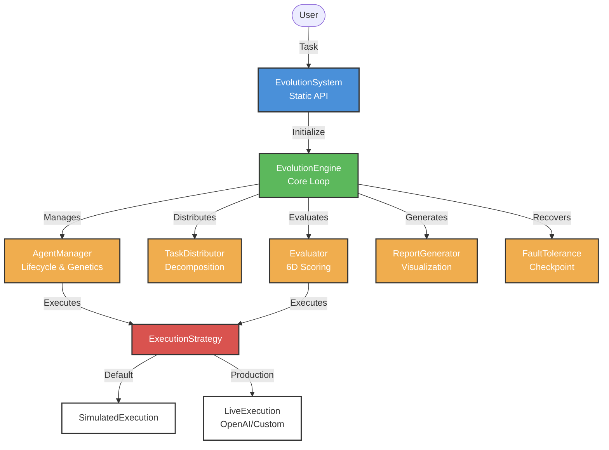

# 物竞天择 / Survival

[English](README.md) | [中文](README.zh-CN.md)

[](https://www.npmjs.com/package/@wujingtianze/core)
[](https://opensource.org/licenses/MIT)
[](https://www.typescriptlang.org/)
[](https://nodejs.org/)

> A powerful multi-agent competitive evolution system based on natural selection principles.

## Overview

物竞天择 / Survival implements a **generational multi-agent optimization framework** where multiple AI agents compete on tasks, progressively filtering out underperforming agents while survivors learn from eliminated agents through genetic recombination and mutation. This approach mimics natural selection to continuously evolve and produce optimal solutions.

### Key Features

- 🧬 **Multi-Agent Evolution**: Create diverse agent populations with varied strategies and capability profiles
- 🎯 **Competitive Selection**: Six-dimensional evaluation (quality, efficiency, creativity, collaboration, resource usage, error rate)
- 🔀 **Genetic Recombination**: Survivors produce offspring through crossover and mutation
- 📚 **Knowledge Sharing**: Global knowledge pool with anti-toxic competition detection
- 🛡️ **Fault Tolerance**: Checkpoint/resume, misjudgment recovery, and rollback capabilities
- 🔌 **Plugin Architecture**: Extensible via lifecycle hooks and custom metrics
- 📊 **Rich Reporting**: Console, HTML, CSV, JSON, and Markdown export formats
- 🎨 **Visualization**: SVG charts and interactive dashboards

## Installation

```bash
npm install @wujingtianze/core
```

### Prerequisites

- Node.js >= 18.0.0
- TypeScript >= 5.0 (for TypeScript projects)

## Quick Start

```typescript
import { EvolutionSystem } from '@wujingtianze/core';

const task = {
  id: 'sort-algo-task',
  type: 'code_generation',
  description: 'Implement an efficient sorting algorithm',
  requirements: [
    'Time complexity better than O(n²)',
    'Support custom comparator',
    'Include unit tests'
  ],
  evaluationCriteria: { 
    correctness: 0.4, 
    performance: 0.3, 
    readability: 0.2, 
    testCoverage: 0.1 
  }
};

const report = await EvolutionSystem.run(task, {
  agentCount: 10,
  maxGenerations: 50,
  mode: 'standard',
  visualization: true
});

console.log(EvolutionSystem.generateReport(report));
```

## Runtime Modes

| Mode | Agents | Generations | Selection Rate | Best For |
|------|--------|-------------|----------------|----------|
| `quick` | 5 | 20 | 0.2 | Simple tasks, rapid prototyping |
| `standard` | 10 | 50 | 0.1 | Regular tasks, balanced quality/speed |
| `deep` | 20 | 100 | 0.05 | Complex tasks, optimal solutions |
| `team` | 15 | 80 | 0.08 | Multi-domain collaborative tasks |

### Quick Mode Methods

```typescript
const report = await EvolutionSystem.quick(task);     // Quick mode
const report = await EvolutionSystem.standard(task);  // Standard mode
const report = await EvolutionSystem.deep(task);      // Deep evolution
const report = await EvolutionSystem.team(task);      // Team collaboration
```

## Core Concepts

### Agent Lifecycle

1. **Generation**: Diverse agents created with varied strategies and capability profiles
2. **Execution**: Agents attempt task solutions (simulated or via real AI executors)
3. **Evaluation**: Six-dimensional scoring across quality, efficiency, creativity, collaboration, resource usage, and error rate
4. **Selection**: Low-performing agents eliminated based on adaptive selection rate
5. **Evolution**: Survivors produce offspring through genetic crossover and mutation
6. **Knowledge Transfer**: Eliminated agents' experiences extracted to global knowledge pool

### Execution Strategies

The system supports two execution modes:

- **Simulated Execution** (default): Fast, deterministic testing with simulated agent behavior
- **Live Execution**: Real AI execution via OpenAI or custom executors

```typescript
import { EvolutionEngine, OpenAIExecutor, LiveExecution } from '@wujingtianze/core';

// Live execution with OpenAI
const executor = new OpenAIExecutor({ 
  apiKey: process.env.OPENAI_API_KEY,
  model: 'gpt-4'
});

const engine = new EvolutionEngine(config, undefined, executor);
const report = await engine.run(task);
```

## Advanced Usage

### Plugin System

```typescript
import { EvolutionEngine, PluginManager, BasePlugin } from '@wujingtianze/core';

class PerformanceTracker extends BasePlugin {
  name = 'performance-tracker';
  version = '1.0.0';

  onGenerationStart(generation: number, agents: Agent[]) {
    console.log(`Starting generation ${generation} with ${agents.length} agents`);
  }

  onEvolutionComplete(report: EvolutionReport) {
    console.log(`Evolution complete! ${report.totalGenerations} generations`);
  }
}

const pluginManager = new PluginManager();
pluginManager.register(new PerformanceTracker());

const engine = new EvolutionEngine(config, pluginManager);
```

### Custom Metrics

```typescript
import { Evaluator } from '@wujingtianze/core';

const evaluator = new Evaluator(config);
evaluator.registerMetric('maintainability', (agent, task, context) => {
  return calculateMaintainability(agent);
});

evaluator.setWeights({
  quality: 0.3,
  efficiency: 0.2,
  maintainability: 0.2,
  creativity: 0.15,
  collaboration: 0.15
});
```

### Real-time Progress

```typescript
const report = await EvolutionSystem.run(task, config, (progress) => {
  console.log(
    `Gen ${progress.generation}: ` +
    `${progress.activeAgents} agents, ` +
    `best: ${(progress.bestScore * 100).toFixed(1)}%`
  );
});
```

### Checkpoint & Resume

```typescript
const engine = new EvolutionEngine(config);

// Save checkpoint
await engine.saveCheckpoint('checkpoint-001');

// Resume later
const report = await engine.resumeFromCheckpoint('checkpoint-001', {
  maxGenerations: 150  // Adjust parameters on resume
});
```

### Misjudgment Recovery

```typescript
const agentManager = engine.getAgentManager();
const eliminated = agentManager.getEliminatedAgents();

// Resurrect high-potential agent
agentManager.resurrectAgent('agent-007');
```

## Report Export

### Multiple Formats

```typescript
import { ReportExporter, ChartGenerator } from '@wujingtianze/core';

// JSON
const json = ReportExporter.toJSON(report, { pretty: true });

// CSV
const csv = ReportExporter.toCSV(report);
const timelineCsv = ReportExporter.timelineToCSV(report);

// Markdown
const markdown = ReportExporter.toMarkdown(report);

// HTML Dashboard
const html = ChartGenerator.generateDashboard(report);

// Batch export all formats
const files = ReportExporter.exportAll(report, './output');
```

### Visualization

```typescript
import { ChartGenerator } from '@wujingtianze/core';

// Performance over time
const perfChart = ChartGenerator.generatePerformanceChart(report);

// Feature importance
const featureChart = ChartGenerator.generateFeatureImportanceChart(report);

// Strategy distribution
const strategyChart = ChartGenerator.generateStrategyDistributionChart(report);
```

## Configuration

```typescript
interface EvolutionConfig {
  agentCount: number;              // Initial agent count (default: 10)
  selectionRate: number;           // Selection rate per round (default: 0.1)
  mutationRate: number;            // Mutation probability (default: 0.05)
  inheritanceRate: number;         // Experience inheritance ratio (default: 0.3)
  maxGenerations: number;          // Max evolution generations (default: 100)
  collaborationBonus: number;      // Collaboration bonus (default: 0.2)
  knowledgeSharing: boolean;       // Enable knowledge pool (default: true)
  teamMode: boolean;               // Team evolution mode (default: false)
  teamSize?: number;               // Agents per team
  faultTolerance: boolean;         // Fault tolerance (default: true)
  visualization: boolean;          // Visualization reports (default: true)
  evaluationMetrics: string[];     // Evaluation metrics
  mode: 'quick' | 'standard' | 'deep' | 'team';
  rescueThreshold: number;         // Threshold for auto-rescue (default: 0.7)
  convergenceThreshold: number;    // Convergence detection (default: 0.95)
  stagnationLimit: number;         // Stagnation detection (default: 10)
  checkpointInterval: number;      // Checkpoint frequency (default: 10)
}
```

### Config Validation

```typescript
import { ConfigValidator } from '@wujingtianze/core';

const { config, warnings } = ConfigValidator.validateWithWarnings({
  agentCount: 15,
  mode: 'deep'
});

if (warnings.length > 0) {
  warnings.forEach(w => console.warn(w));
}
```

## CLI Usage

```bash
# Install globally
npm install -g @wujingtianze/core

# Run evolution
evolution run --config ./config.json --task ./task.json --output ./reports

# Generate default config
evolution config --generate --output ./config.json

# Validate config
evolution config --validate ./config.json

# Benchmark
evolution benchmark --iterations 5 --mode quick

# Compare configurations
evolution compare --configs config-a.json config-b.json --task task.json
```

## Architecture



## Modules

| Module | Responsibility |
|--------|---------------|
| `EvolutionEngine` | Main evolution loop, coordinates all modules, executes plugin hooks |
| `AgentManager` | Agent lifecycle, genetic recombination, knowledge pool, anti-toxic detection |
| `Evaluator` | Multi-dimensional evaluation, adaptive selection, convergence detection |
| `TaskDistributor` | Task decomposition, intelligent assignment, load balancing |
| `ReportGenerator` | Settlement reports, HTML visualization, multiple export formats |
| `FaultToleranceManager` | Checkpoint resume, misjudgment recovery, health checks, rollback |
| `PluginManager` | Plugin registration, lifecycle hook execution, custom metrics/mutations |
| `ExecutionStrategy` | Abstract execution layer (simulated or live AI execution) |

## Use Cases

- **Complex Problem Solving**: Parallel multi-solution attempts with optimal selection
- **Code Generation**: Multi-agent competition for best implementation
- **Creative Solution Screening**: Fusion of multiple approaches into optimal output
- **Data Analysis**: Multi-perspective analysis synthesis
- **AI Model Training**: Adversarial evolution for performance improvement
- **Code Review**: Multi-view quality inspection
- **Risk Assessment**: Parallel multi-model evaluation
- **Content Creation**: Multi-style competition for optimal output

## API Reference

See [SKILL.md](./SKILL.md) for detailed API documentation and usage examples.

## Contributing

We welcome contributions! Please see our [Contributing Guide](CONTRIBUTING.md) for details.

1. Fork the repository
2. Create your feature branch (`git checkout -b feature/amazing-feature`)
3. Commit your changes (`git commit -m 'Add amazing feature'`)
4. Push to the branch (`git push origin feature/amazing-feature`)
5. Open a Pull Request

### Development Setup

```bash
git clone https://github.com/charlesilcn/survival.git
cd survival
npm install
npm run build
npm test
```

### Running Tests

```bash
# Run all tests
npm test

# Run with coverage
npm run test:coverage

# Run in watch mode
npm run test:watch
```

## License

This project is licensed under the MIT License - see the [LICENSE](LICENSE) file for details.
